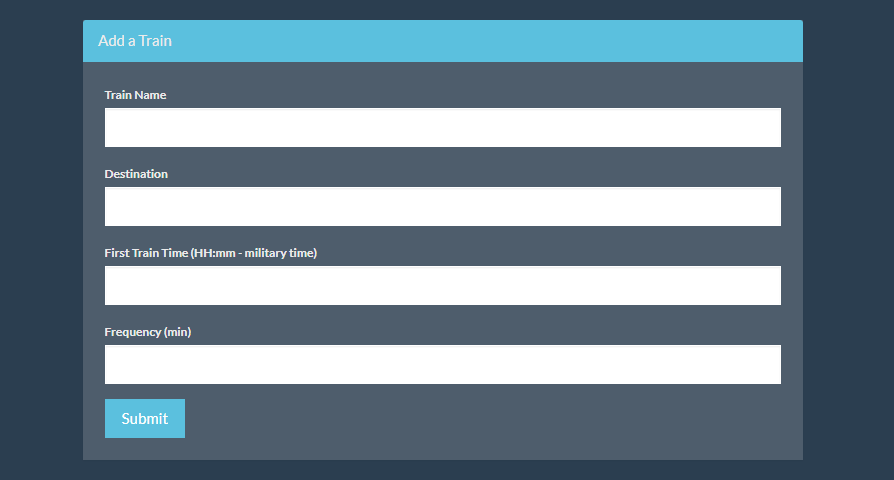
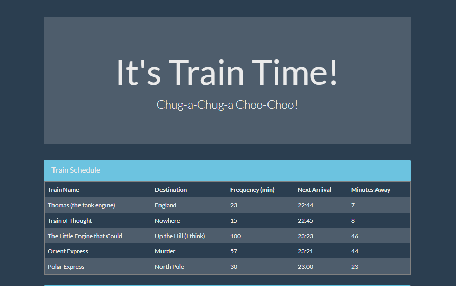

# Train-time 

## Firebase  Train Scheduler

### Overview

This application is train schedule that incorporates Firebase to host arrival and departure data. The app retrieves and manipulates this information with Moment.js. This website provides up-to-date information about various trains, namely their arrival times and how many minutes remain until they arrive at their station.

### Instructions

* When adding trains, users can submit the following:
    
    * Train Name
    
    * Destination 
    
    * First Train Time -- in military time
    
    * Frequency -- in minutes

  
* This app calculates what time the next train will arrive and in how many minutes relative to the current time.
  
* Users from different machines are able to view same train times.

 

